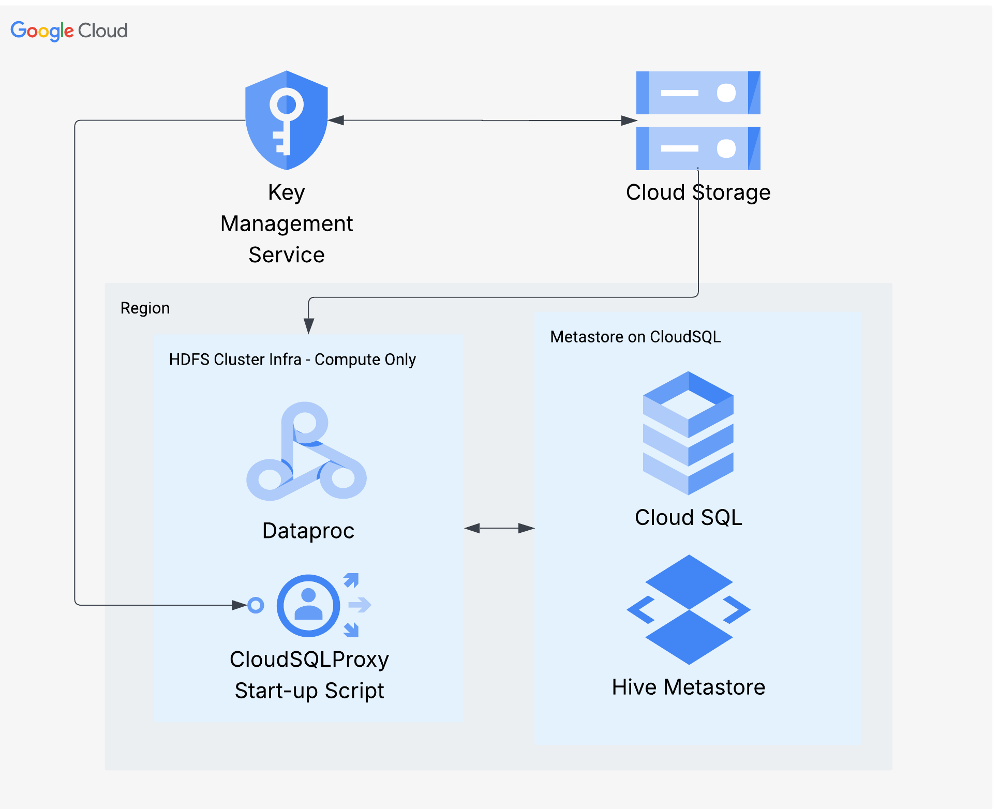

# A Guide for INFO 602 Big Data Analytics on Cloud Platforms Students on using Hive on an HDFS-like Cluster

This guide is primarily inteded to assist you in deploying the architecture, in a secure and reusable manner, that will enable data warehousing operations using Hive on cloud provisioned services (Google Cloud Platform - GCP). Google provides serveral compute, storage, and utility services specifically intended to make this possible.



The best guide on how to securely configure and provision services for Hive on Dataproc can be found on the repository for [Google's cloud SQL Proxy initialization script.](https://github.com/GoogleCloudDataproc/initialization-actions/blob/main/cloud-sql-proxy/README.md)

## Create a Cloud SQL Instance

Because the Hive metastore must be installed on an accessible (to the cluster/hive) relational database (Google primarily support postgres sqlserver and mysql) you need to provision an economical cloud sql instance.
```sh
    gcloud sql instances create INSTANCE_NAME \
    --region=REGION \
    --tier=TIER \
    --database-version=DATABASE_VERSION \
    --edition=ENTERPRISE
```
Important to note is that you want to choose a developer sandbox, and use database-version=MYSQL_8_4. Details on sql instance creation can be found [here](https://docs.cloud.google.com/sdk/gcloud/reference/sql/instances/create)

## Create Google Cloud KMS Keys

Note this is taken from [here](https://github.com/GoogleCloudDataproc/initialization-actions/blob/main/cloud-sql-proxy/README.md)

If you want to protect the passwords for the `root` and `hive` MySQL users, you
may use [Cloud KMS](https://cloud.google.com/kms/), Google Cloud's key
management service. You will only need to encrypt and provide a root password if
the `hive` user does not already exist in MySQL. Proceed as follows:

1.  Create a bucket to store the encrypted passwords:

    ```bash
    gsutil mb gs://<SECRETS_BUCKET>
    ```

2.  Create a key ring:

    ```bash
    gcloud kms keyrings create my-key-ring --location global
    ```

3.  Create an encryption key:

    ```bash
    gcloud kms keys create my-key \
        --location global \
        --keyring my-key-ring \
        --purpose encryption
    ```

4.  Encrypt the `root` user's password  and Encrypt the `hive` user's password - then upload the encrypted passwords to your secrets GCS bucket. This repository contains a [script](./encrypt_passwords.sh) that should do this final step for you with some modifications as shown below:

    ```bash
    echo "Ent3r_the_metastore" | gcloud kms encrypt \
    --location=global \
    --keyring=etudo-bda-keyring \
    --key=hive-db-key-v1 \
    --plaintext-file=- \
    --ciphertext-file=hive-password.encrypted
    echo "your password here" | gcloud kms encrypt \
    --location=global \
    --keyring=etudo-bda-keyring \
    --key=hive-db-key-v1 \
    --plaintext-file=- \
    --ciphertext-file=hive-admin-password.encrypted
    gcloud storage cp *.encrypted gs://your-bucket-of-keys/
    ```
    Remember that you'll have to run this from WSL as these are bash scripts! Don't forget to alter the file permissions if you use scripts from this repo so that they become excutable:

    ```sh
    chmod +x my-script.sh
    ```
    ## Create the Dataproc Cluster

    At this point you are ready to create the dataproc cluster. I have provided a [script](./create_hive_cluster.sh) that will do this for you. However, it is your job to modify the variables to suit your environment's namespace. You'll need bits of information from all of the steps above. 

    You'll note that in the cluster creation script, there is the following directive to the cluster create command:

    ```sh
    --initialization-actions gs://goog-dataproc-initialization-actions-${REGION}/cloud-sql-proxy/cloud-sql-proxy.sh \
    ```

    This is a reference to the cloud-sql-proxy initialization script created by Google's Dataproc team. This script is critical for setting up any Dataproc cluster technologies that rely on a hive metastore database - including Hive itself of course! This script connects your cluster to the SQL Instance that you created earlier. It relies on you providing accurate --metadata flags with important information about this connection when you set up your cluster create command. 

    For instance: 
    ```sh
    --metadata "hive-metastore-instance=${PROJECT_ID}:${REGION}:${SQL_INSTANCE_NAME}"
    ```
    Is a metadata key=value pair that the cloud-sql-proxy.sh script depends upon. The script will search for metadata with the key `hive-metastore-instance`. If found the corresponding value will be used to identify the Cloud SQL Instance where you'd like the metastore to live. Look at each `--metadata` flag and try to find where it's key is refrenced in the cloud-sql-proxy.sh script.

    To ensure repeatability, you should download and persist a copy of the cloud-sql-proxy.sh script for your specified region (notice the `${REGION}` substitution). I've provided a copy from the *us-east4* region, [here](./cloud-sql-proxy.sh), in this repository. 