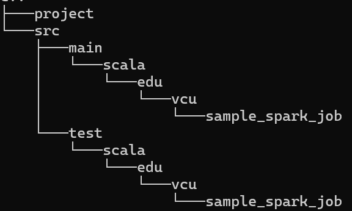
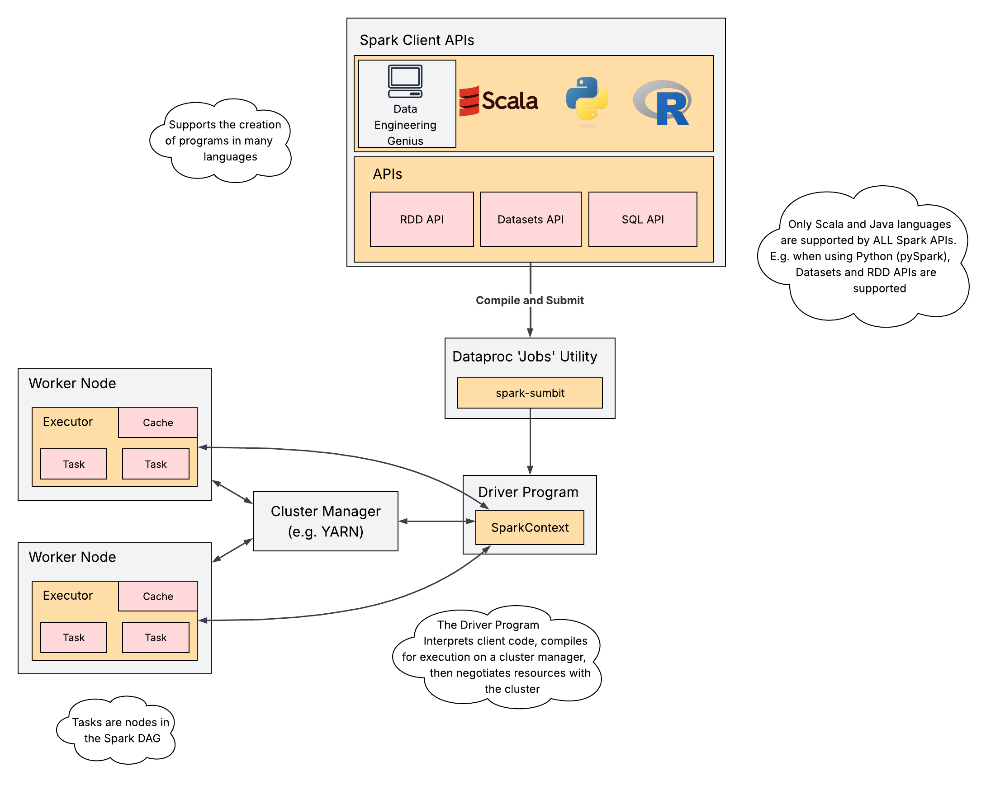

# Beyond the REPL: Writing and Submitting Spark Applications with `spark-submit` and GCP Dataproc

## Project Structure

Here is how this Spark Project is structured. It is generated from an ubiquitous archetype from SBT. If you have SBT installed (strongly recommend you do this - but I'll leave installation to you), you can generate Spark-ready project structures with the enclosed examples using: `sbt new holdenk/sparkProjectTemplate.g8`



## Overview
When there exists a need to create repeatable, complex Spark code, turn to spark-submit. Spark submit is a utility (implemented in GCP Dataproc and available in your Spark bin/ directory) for submitting Spark programs. This is *exactly* analogous to `hadoop jar` for MapReduce. 

So, as in the MapReduce case, we write up some code in a language supported by the Spark API - we'll use the Scala as our language because it is native to Spark and is supported by all Spark APIs. See the diagram below for a distillation of this process.



A scala program written for Spark simply has to import the relevant Spark API libraries and provide an entry point with arguments. Those arguments are made visible to spark-submit. For instance, in this demonstration repo you'll encounter the following in `CountingApp.scala`:

```scala
object CountingApp extends App{
  val (inputFile, outputFile) = (args(0), args(1))

  // spark-submit command should supply all necessary config elements
  Runner.run(new SparkConf(), inputFile, outputFile)
}
```

Notice that no spark configuration is given in this example - just a freshly initialized SparkConf. This is because spark-submit supplies the configuration for the cluster into which you are submitting the job. See the Runner code for details on `Runner.run()`.

## Usage
You can use this code to help you with the Spark Lab (typically Lab 4). Modify it as needed and execute. You'll need to install Scala Build Tools (sbt) which is a build tool for - you guessed it - Scala. It plays an identical role to Maven. Indeed, because Scala code is compiled into JVM machine code, you can use Maven to build Scala if you prefer it. But this is generally not recommended. 

With sbt, you can orchestrate the compilation, dependency imports, environment etc of a scala program by configuring a `build.sbt` file. Check out the example in this repo. Without it, you will have to manually compile your scala program, making sure that all dependencies are within scope of the scala compiler. 

Here's how sbt can be used to run this program

```sh
sbt "run resources/big.txt big_wordCount.txt"
```

This will compile your code and attempt to run it (much like `mvn run`). As the script completes compilation, it encounters the fact that there exist multiple entry points into the program and prompts you with: 

```
Multiple main classes detected. Select one to run:
 [1] edu.vcu.sample_spark_job.CountingApp
 [2] edu.vcu.sample_spark_job.CountingLocalApp

Enter number: 
```
Choose 2, press enter.

In scala, an `object` is a static class whose members can be run/accessed without instantiation - in fact you never instantiate static classes! You'll note that across the two `.scala` files in `src` (where your program's source code resides) there are certain objects that extend the App trait:

```scala
object CountingApp extends App {...}
```
Extending this trait converts the object into an entry point! You'll see the same signature on the CountingApp Method. Use the Scala 2 Book to understand [App Trait](https://docs.scala-lang.org/overviews/scala-book/hello-world-2.html) in more detail.

## Spark Job Submission

### Using `spark-submit`
To run a spark application using `spark-submit`, you first need to bundle the Scala program into a JAR. You want to use a standalone JAR unless you have extraneous dependencies (which you shouldn't have). We talked about bundled/standalone JARs in the MapReduce context. Standalone JARs anticipate that some program/environment with the application's dependencies will be used to run your scala program. You should already have every dependency you'll need. This is ideal because bundling dependencies in a JAR creates, typically, a massive artefact. 


You'll recall that to submit and run a MapReduce Job on your local HDFS pseudo-clusters you did something roughly like: 
```sh
hadoop jar wcmr-1.0-SNAPSHOT.jar \
    edu.vcu.WordCount \
    arg1 arg2
```

Now, say you'd like to use spark-submit to run an application locally on Spark, written in scala or java, and say your current working directory === SPARK_HOME, you'd write something like:
```sh
./bin/spark-submit \
  --class edu.vcu.sample_spark_job.CountingApp \
  --master local[*] \
  --deploy-mode client \
  --conf spark.eventLog.enabled=false \
  --conf <key>=<value> # additional configs \
  sample_spark_job_2.12.jar \
  arg1 arg2
```
* Learn the various configuration (--conf) options [here](https://spark.apache.org/docs/latest/configuration.html).
    * These configuration options are passed to the SparkConf() object that we discussed [above](#overview).
* `local[*]` means use every available core on localhost (the computer you are reading this from, ostensibly).
    * have you seen this before? Look for it when you open `spark-shell`
    * Guess what `local[2]` means...
* You can deploy in "client" mode or in "cluster" mode. Indicate your preference using `--deploy-mode`
* The final options are positional (i.e. interpreted based on their being the final options in the sequence of options available to the `spark-submit` command)
    * After specifying **all** of your desired named options (those with flags such as --master, --deploy-mode etc), you must provide a globally accessible application JAR file URI. The URI must be globally visible inside of your cluster, for instance, an hdfs:// path or a file:// path that is present on all nodes
    * After the application-jar, you can specify arguments. If you are running the examples contained in this example, be sure that you know:
        1. If arguments are required for the class/object (see the objects that extent the `App` trait) that you'd like to run
        2. What those areguments are, and their positional ordering - args are not positionally interchangable! 


### Submitting Spark Jobs to Dataproc (or whatever Google decides it is called when you are reading this)

When you setup your scala program using the `sbt new holdenk/sparkProjectTemplate.g8` archetype/template, you'll be prompted for spark and scala versions. Be sure to match those with your dataproc cluster. Again, use a standalone JAR when you prepare your app for submission to the cluster.

I recommend/prefer the gcloud CLI for interfacing with GCP resources. The CLI (i.e. the gcloud SDK) has a Spark submit command. The Cloud Console (the GUI - ew) can also be used, but we want to be hardcore and, crucially, repeatable, so we'll avoid that. You can see the full details of the gcloud CLI command for submitting spark jobs to a dataproc cluster [here](https://docs.cloud.google.com/sdk/gcloud/reference/dataproc/jobs/submit/spark). 

It is no coincidence that `gcloud dataproc jobs submit spark` is structured in a very similar way to `spark-submit` - afterall it is a wrapper for `spark-submit`

Here is what you'd write to run this example (roughly!) on Dataproc - if you've copied your JAR file to the cluster, otherwise, omit file:/// and use the local path to your JAR:
```sh
gcloud dataproc jobs submit spark \
    --cluster=etudo-hive-cluster-v3-sp26 \
    --region=us-east4 \
    --class=edu.vcu.sample_spark_job.CountingApp \
    --jars=file:///sample_spark_job_2.12.jar \
    -- gs://etudo-bda-2026/big.txt gs://etudo-bda-2026/bigCount
```
Note the hanging `--` prior to the two args...

Get Sparking Y'all!!!


